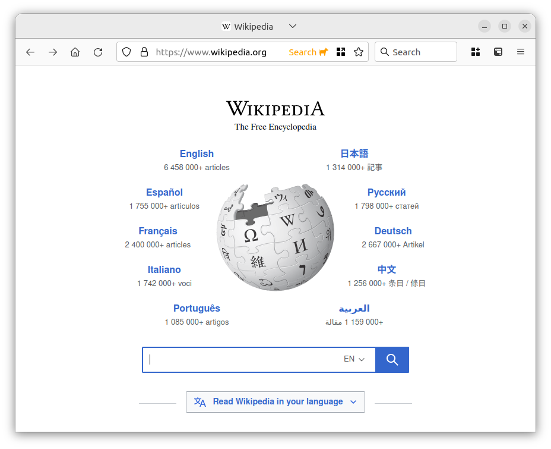
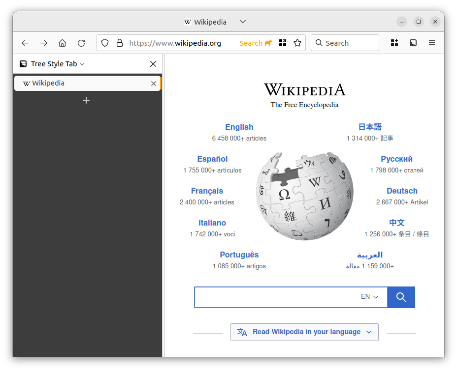

# firefox-hide-tabs

A CSS override that pairs well with the [Tree Style Tab](https://github.com/piroor/treestyletab) extension (which enables managing tabs in a side panel). It is basically an enhanced title bar for Firefox.

It removes tabs from the toolbar but keeps the current tab's title and favicon, as well as the "List all tabs" button, which can be used to manage tabs until you feel the need to open the side panel.

It has been tested with (Ubuntu 22):
- Firefox 105 ([v1.0](releases/tag/v1.0))
- Firefox 106 ([v2.0](releases/tag/v2.0))
- Firefox 108 ([v3.0](releases/tag/v3.0))

 I *may* continue to maintain it.

## How to use

1) Navigate to `about:config` and set `toolkit.legacyUserProfileCustomizations.stylesheets` to `true`;

1) Navigate to `about:support` and locate your `Profile Directory`;

3) Create a `chrome` directory there if does not already exist, and place `hide-tabs.css` and `userChrome.css` in that directory;

4) Restart Firefox.